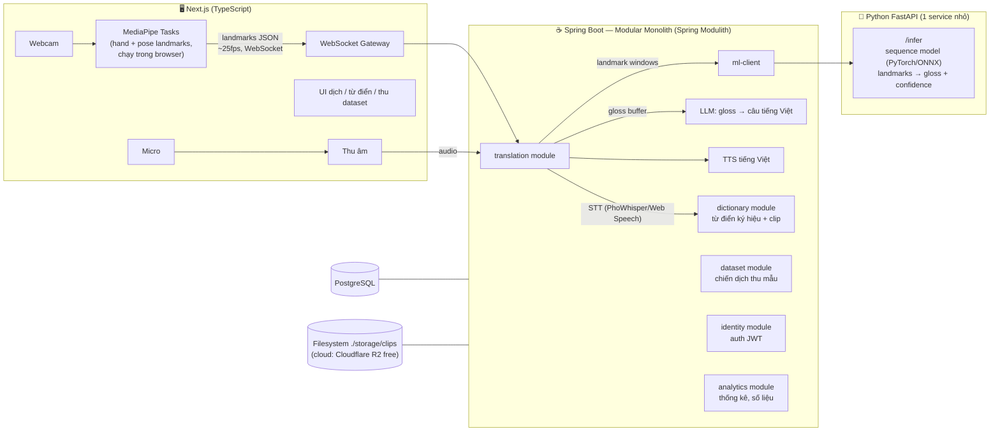

# SignBridge — Kế hoạch Đồ án Tốt nghiệp

> **Hệ thống dịch ngôn ngữ ký hiệu tiếng Việt (VSL) hai chiều, thời gian thực**
> Phiên bản kế hoạch: v1.0 — 26/07/2026. Sẽ cập nhật sau đợt xác minh kỹ thuật (mục 11).

---

## 1. Tóm tắt đề tài

Người khiếm thính ra ký hiệu trước webcam → hệ thống nhận diện theo thời gian thực → ghép thành câu tiếng Việt tự nhiên → hiển thị văn bản + đọc thành tiếng. Chiều ngược lại: người nghe nói vào micro → nhận dạng giọng nói → ánh xạ sang chuỗi ký hiệu → phát clip ký hiệu (stretch: avatar 3D).

**Đóng góp chính của đồ án:**
1. Hệ thống VSL hai chiều hoạt động thời gian thực đầu tiên ở mức đồ án tại VN (huấn luyện trên dataset công khai Multi-VSL — WACV 2025).
2. Lớp chuyển đổi *gloss → câu tiếng Việt tự nhiên* bằng LLM (ngữ pháp VSL khác ngữ pháp tiếng Việt nói).
3. Kiến trúc modular monolith chuẩn công nghiệp (Spring Modulith) + pipeline ML tách biệt, kèm số liệu đánh giá đầy đủ (accuracy, latency, khảo sát người dùng).

**Phạm vi (scope) — cam kết rõ để bảo vệ:**
- ✅ Nhận diện ký hiệu RỜI (isolated), bộ từ vựng 100–200 ký hiệu (ưu tiên chủ đề y tế — khớp với Multi-VSL).
- ✅ Ghép chuỗi gloss thành câu tự nhiên bằng LLM khi người ký ngắt nhịp.
- ✅ Chiều ngược: giọng nói → chuỗi clip ký hiệu quay sẵn.
- ❌ KHÔNG nhận diện câu ký hiệu liên tục không ngắt (continuous signing — bài toán mở, ghi rõ ở phần hạn chế).
- ❌ KHÔNG sinh chuyển động avatar bằng AI (chỉ phát lại animation/clip có sẵn).

---

## 2. Kiến trúc tổng thể

> Ghi chú triển khai: tầng ghép câu (gloss → câu tiếng Việt bằng LLM + TTS) đã làm sớm ở
> tuần 0 — xem mục 6. Phát hiện "nghỉ tay" dựa vào nhãn `NO_SIGN` model trả về.



**Nguyên tắc kiến trúc:**
- **Spring Modulith** làm xương sống: mỗi module có boundary được kiểm chứng bằng test (`ApplicationModules.verify()`), giao tiếp nội bộ qua application events, tự sinh tài liệu kiến trúc (PlantUML) — đây là điểm "vip pro" để trình bày chương kiến trúc.
- **Python service càng mỏng càng tốt**: chỉ nhận mảng tọa độ → trả nhãn. Không business logic. Với backend, nó chỉ là một HTTP/WS dependency như mọi service khác.
- **MediaPipe chạy phía browser** → server không phải xử lý video, chỉ nhận JSON tọa độ (nhẹ ~vài KB/frame), riêng tư hơn (video không rời máy người dùng) — điểm cộng khi bảo vệ.

## 3. Các module Spring Modulith

| Module | Trách nhiệm | Bảng chính |
|---|---|---|
| `identity` | Đăng ký/đăng nhập, JWT (HS256), phân quyền ADMIN/CONTRIBUTOR/USER; admin tạo từ cấu hình lúc khởi động (đăng ký công khai chỉ ra USER) | users |
| `dictionary` | Từ điển ký hiệu: gloss, mô tả, video clip mẫu (filesystem), danh mục chủ đề | signs, categories, clips |
| `translation` | Phiên dịch: quản lý session WebSocket, cửa sổ trượt, gọi ML service, buffer gloss, gọi LLM ghép câu, gọi TTS | sessions, transcripts |
| `dataset` | Chiến dịch thu mẫu: ai quay, ký hiệu nào, duyệt chất lượng, export ra định dạng train | campaigns, samples |
| `analytics` | Thống kê sử dụng, lưu lịch sử số liệu model (accuracy theo version) | usage_logs, model_metrics |

Giao tiếp giữa module:
- **Sự kiện** cho luồng không nằm trên đường trễ (VD: `GlossRecognized` → `analytics` lắng nghe qua `@ApplicationModuleListener`). Chỉ bọc giao dịch quanh phần publish — KHÔNG bọc cả lời gọi ML, nếu không connection DB bị giữ suốt vòng gọi mạng.
- **Interface công khai** khi cần trả lời đồng bộ (VD: `dataset` gọi `dictionary.SignCatalog` để kiểm gloss có thật). Đây là bề mặt duy nhất được phép gọi xuyên module — repository/entity vẫn đóng gói bên trong.

Không import chéo package nội bộ — Modulith test sẽ fail nếu vi phạm.

## 4. Stack công nghệ

| Lớp | Công nghệ (✅ đã xác minh 26/07/2026) | Ghi chú |
|---|---|---|
| Frontend | Next.js 16 (App Router, TS), TailwindCSS | Trang: Dịch, Từ điển, Thu dataset, Admin |
| CV trong browser | MediaPipe Tasks Vision **pin đúng 0.10.35**, HandLandmarker + PoseLandmarker lite | Bản 1.0 sắp ra (có thể breaking) → WASM + model .task **tự host trong repo**, không load CDN |
| Backend | **Spring Boot 4.1.0 + Spring Modulith 2.1.0**, Java 21, Maven | Raw WebSocket (KHÔNG STOMP); event chỉ dùng ngoài hot path |
| ML service | Python, FastAPI + ONNX Runtime | Serve server-side ở MVP; ONNX Runtime Web là stretch |
| Model | **Transformer trên landmark** (khởi đầu: SPOTER; đích: kiến trúc Kaggle GISLR 1st place 1D-CNN+Transformer) | KHÔNG dùng GCN — phức tạp, lợi ích nhỏ ở 100-200 gloss |
| Gloss → câu | Gemini Flash free tier, prompt few-shot (tiền lệ: Spotter+GPT, arXiv 2403.10434) | Không fine-tune; cache kết quả; interface để đổi sang Claude Haiku |
| STT | **Web Speech API vi-VN là chính** (Chrome 139+ chạy on-device); PhoWhisper-small (faster-whisper int8) là stretch | ChunkFormer-large-vie làm baseline so sánh trong chương đánh giá |
| TTS | edge-tts (vi-VN-HoaiMyNeural/NamMinhNeural) — **sinh sẵn MP3 + cache**, chỉ gọi live cho câu mới | Chống sự cố 403 của Microsoft ngày demo |
| DB / Storage | PostgreSQL; clip ký hiệu lưu **filesystem** (`storage/clips`) | ~~MinIO~~ đã bị archive 04/2026 — KHÔNG dùng; cloud option: Cloudflare R2 free 10GB |
| DevOps | Docker Compose, GitHub Actions (checkout@v7, setup-java@v5), Testcontainers @ServiceConnection | Repo để PUBLIC → CI không giới hạn phút |
| Thí nghiệm ML | Weights & Biases free (đăng ký academic plan bằng email trường) | Biểu đồ đẹp cho chương 4 |

## 5. Dữ liệu & ML

**Nguồn dữ liệu (✅ đã xác minh):**
1. **Multi-VSL (WACV 2025)** — 1.000 gloss, 30 người ký, ~84.000 video, 3 góc quay. Tải qua **2 link Google Drive công khai trong README repo** (không cần form). Chỉ dùng **subset 200 gloss, view chính diện** (split CSV có sẵn: `data/label_1_200/`). Repo KHÔNG có file LICENSE → trích dẫn paper + email tác giả xin xác nhận học thuật. Lưu ý: baseline chính thức là model video (I3D...), KHÔNG phải landmark → benchmark landmark trên Multi-VSL 200 là **đóng góp riêng của đồ án**.
2. **VOYA_VSL (HuggingFace, MIT)** — fallback: 161 lớp keypoint MediaPipe sẵn (60×1605), tải từng lớp, không cần xử lý video.
3. **Tự thu bổ sung** qua chính tính năng `dataset` của hệ thống (mỗi người ~10 mẫu/ký hiệu × 5–10 bạn bè) — chứng minh model chạy với người ngoài dataset gốc + demo tính năng.

**Quy tắc sống còn:** trích landmark huấn luyện bằng **MediaPipe Tasks Python với ĐÚNG các file .task mà browser dùng** (đã vendor trong `apps/web/public/models/`) — không dùng API cũ `mp.solutions`, tránh lệch phân bố train/deploy. Split theo **người ký** (signer-independent), không random split.

**Pipeline huấn luyện:**
```
Video → MediaPipe → chuỗi keypoint (T × N điểm × 3)
     → chuẩn hóa (tâm = vai/hông, scale bất biến, mirror augment)
     → model phân loại chuỗi → gloss + confidence
     → export ONNX → serve trong FastAPI
```

**Suy luận thời gian thực** (theo công thức đã công bố — arXiv 2302.07693): cửa sổ trượt **16–32 frame, stride 2–4**, huấn luyện thêm lớp **"NO_SIGN"** (nền/tay nghỉ), ngưỡng softmax ~0.7 + vote N cửa sổ liên tiếp trước khi chốt gloss, chặn lặp gloss liền kề; phát hiện "nghỉ tay" (~2 giây) → chốt câu, gọi LLM ghép.

**Đánh giá (chương 4 của báo cáo):**
- Top-1/Top-5 accuracy trên test split Multi-VSL (so sánh ≥2 model: LSTM baseline vs Transformer/ST-GCN).
- Accuracy trên tập tự thu (người chưa từng có trong dữ liệu train) — con số trung thực.
- Độ trễ end-to-end (ms): landmark → hiển thị chữ. Mục tiêu < 500ms/ký hiệu.
- Chất lượng câu ghép: đánh giá của người dùng (thang Likert) trên ~30 câu mẫu.
- Khảo sát usability (SUS score) với ≥10 người dùng thử.

## 6. Lộ trình 16 tuần

> Nhánh **[HỌC]** chạy song song, không chặn nhánh **[LÀM]**.
>
> **Tiến độ 26/07/2026 (trước tuần 1):** ✅ Tuần 1 xong (skeleton + demo MediaPipe chạy thật trên webcam);
> ✅ Tuần 2 xong sớm (identity JWT + phân quyền, dictionary + upload clip, trang /dictionary);
> ✅ Tuần 3 công cụ thu dataset xong sớm (module dataset + trang /collect + script trích landmark).
>
> ✅ **Tuần 8 (tầng ngôn ngữ) xong sớm**: buffer gloss theo phiên → phát hiện nghỉ tay (nhãn `NO_SIGN`)
> → Gemini Flash ghép thành câu tiếng Việt tự nhiên (prompt few-shot, có cache + ghép dự phòng
> từ từ điển khi mất mạng) → hiện chữ + đọc thành tiếng bằng SpeechSynthesis vi-VN.
> Đã chạy thật với API key: `BAC_SI / XIN_CHAO / TOI / DAU / KHAM_BENH` → *"Xin chào bác sĩ, tôi bị đau nên cần khám bệnh."*
>
> ✅ **Tuần 4-5 (bộ huấn luyện) chuẩn bị xong trước**: `training/model/` (dataset loader với
> augment + lớp NO_SIGN tổng hợp, SignTransformer, train.py export ONNX + labels.json),
> notebook exp01 (trích landmark) + exp02 (train trên Colab GPU). **Đã smoke-test toàn trình
> trên dữ liệu giả ngay tại máy**: train → ONNX → nạp vào apps/ml → frame tay nghỉ ra
> NO_SIGN 96.6% — nghĩa là khi có landmark thật chỉ việc chạy exp02, không dò bug trên giờ GPU.
> apps/ml giờ có 2 chế độ: ONNX thật (khi có `apps/ml/model/`) / stub (mặc định).
>
> **Chất lượng:** 9/9 test Java (Modulith verify + Testcontainers + unit ghép câu), 17/17 test E2E
> hạ tầng, 6/6 test E2E ghép câu, ESLint sạch, web build sạch.
> **18 lỗi thật đã bắt & sửa** (3 qua test E2E + 15 qua review đa tác nhân có xác minh đối kháng):
> WS buffer 8KB · JDK HttpClient h2c vs uvicorn · Security chặn /error · React StrictMode làm chết
> vòng lặp nhận diện · chiếm quyền ADMIN qua đăng ký đầu tiên · WS không giới hạn buffer/số chiều ·
> vòng window/stride sai · @Transactional giữ connection suốt lời gọi ML · MlClient thiếu timeout ·
> race onclose WebSocket · gloss không kiểm theo từ điển · ghi file không atomic · event_publication
> phình vô hạn · tên clip theo gloss gây ghi đè · 409 trùng email · rò WebGL context.
>
> ✅ **Tuần 10 (chiều ngược) xong sớm**: import 30 clip từ **Từ điển ngôn ngữ ký hiệu quốc gia
> QIPEDC** (HF Lakeserl/SignConnect, 4.362 video) vào module dictionary qua API thật; endpoint
> `/api/signs/compose` khớp-cụm-dài-nhất ("đau bụng" ăn nguyên cụm) + báo từ thiếu trung thực;
> trang **/speak**: gõ/nói tiếng Việt (Web Speech vi-VN) → phát tuần tự clip ký hiệu.
>
> ⚠️ **Dataset pivot (26/07)**: folder Drive công khai Multi-VSL chỉ là demo ~1% → chiến lược mới:
> (1) user request **VSL400** trên Zenodo (24.753 lượt ký × 3 view, 400 gloss, 28 người ký,
> CC-BY-4.0, 961 người đã được cấp); (2) email tác giả Multi-VSL (docs/EMAIL-MULTIVSL.md);
> (3) dự phòng: tự thu qua /collect (converter sẵn sàng). Dây chuyền exp01/exp02 dùng nguyên
> cho VSL400 khi được cấp quyền.
>
> Còn lại của tuần 2-3: chờ quyền dataset + nhánh [HỌC] Python/LSTM.

| Tuần | [LÀM] Sản phẩm | [HỌC] Kiến thức |
|---|---|---|
| 1 | Khởi tạo monorepo, Docker Compose (Postgres, MinIO), skeleton Spring Modulith + Next.js; demo MediaPipe vẽ khung xương tay trên webcam chạy được | Python cơ bản (đã biết lập trình → nhanh) |
| 2 | Module `identity` + `dictionary` (CRUD + upload clip lên MinIO); tải Multi-VSL, khám phá dữ liệu | numpy, đọc hiểu cấu trúc keypoint |
| 3 | Trang thu dataset (đếm ngược → quay → trích keypoint ngay trong browser → upload); tiền xử lý Multi-VSL subset thành keypoint | Tutorial LSTM sign detection (làm lại end-to-end với 3 ký hiệu) |
| 4 | Train model đầu tiên trên ~30 gloss (Colab), log W&B; FastAPI `/infer` v0 | Lý thuyết: LSTM/Transformer là gì, train/val/test, overfitting |
| 5 | Mở rộng 100 gloss; thí nghiệm so sánh model #1 vs #2; chọn model chính | Attention, data augmentation |
| 6 | Pipeline real-time v0: browser → WS → Spring `translation` → FastAPI → hiện gloss trên UI | Spring Modulith events, WebSocket |
| 7 | Cửa sổ trượt + debounce + ngưỡng; đo độ trễ; tinh chỉnh UX hiển thị | ONNX export/runtime |
| 8 | **Milestone giữa kỳ: demo live nhận diện 20 ký hiệu ổn định.** ~~LLM ghép gloss → câu + TTS~~ (đã xong sớm) → thay vào đó: tinh chỉnh prompt theo gloss thật + nâng TTS lên giọng neural | Prompt engineering |
| 9 | Thu dữ liệu bổ sung từ 5–10 bạn; fine-tune lại; đánh giá người-ngoài-dataset | — |
| 10 | Chiều ngược: STT → mapping từ khóa → phát chuỗi clip ký hiệu từ `dictionary` | PhoWhisper/Web Speech |
| 11 | Module `analytics` + dashboard số liệu; hoàn thiện admin | — |
| 12 | (Stretch nếu kịp) Avatar 3D phát animation thay clip; hoặc dồn lực đánh bóng | Three.js cơ bản |
| 13 | Đo đạc toàn bộ số liệu chương 4; khảo sát SUS ≥10 người; sửa lỗi | — |
| 14 | Viết báo cáo (kiến trúc + thí nghiệm chiếm phần lớn — số liệu đã có sẵn từ W&B) | — |
| 15 | Hoàn thiện báo cáo + slide; quay video backup toàn bộ demo | — |
| 16 | **Tổng duyệt demo ≥3 lần** (thử ánh sáng khác nhau); dự phòng rủi ro; nộp | — |

## 7. Chiến lược demo trước hội đồng

1. **Demo live** bộ 10–15 ký hiệu "ruột" đã tập kỹ (chào hỏi + y tế): ký hiệu → chữ hiện + máy đọc.
2. Mời một thành viên hội đồng **nói một câu** → hệ thống phát chuỗi clip ký hiệu (chiều ngược — tương tác trực tiếp, rất ăn điểm).
3. Video quay sẵn cho toàn bộ 100–200 ký hiệu + kịch bản dài.
4. **Backup 3 lớp**: video demo đầy đủ; app chạy offline được (model local, TTS có fallback); laptop dự phòng đã cài sẵn.
5. Slide kiến trúc: khoe sơ đồ module tự sinh từ Spring Modulith + biểu đồ thí nghiệm từ W&B.

## 8. Rủi ro & đối sách

| Rủi ro | Xác suất | Đối sách |
|---|---|---|
| ~~Multi-VSL bị gate~~ → chỉ còn rủi ro quota tải Google Drive folder lớn | Thấp-TB | Tải rải 2-3 ngày, chỉ lấy subset 200/center; trích landmark xong xóa video ngay; fallback VOYA_VSL (MIT, keypoint sẵn) |
| MediaPipe 1.0 ra giữa kỳ, breaking API (rc nightly đã xuất hiện từ 06/2026) | TB | Đã pin 0.10.35 + tự host WASM/model trong repo — không nâng cấp giữa đồ án |
| Accuracy thấp với người lạ | TB-Cao | Thu bổ sung nhiều người; augment; demo bằng chính mình (hợp lệ, minh bạch trong báo cáo) |
| Kẹt phần ML do chưa có nền | TB | Đi từ code baseline có sẵn của Multi-VSL, không viết từ 0; tuần 3–4 làm tutorial trước |
| LLM API chết lúc demo | Thấp | Cache câu cho kịch bản demo; fallback ghép câu rule-based đơn giản |
| Trễ tiến độ | TB | Milestone tuần 8 là điểm quyết định: nếu trễ → cắt avatar 3D, giữ 100 gloss thay vì 200 |
| Hội đồng hỏi lý thuyết sâu | Chắc chắn | Tuần 4–5 học có hệ thống; chuẩn bị sẵn 20 câu hỏi dự kiến + trả lời |

## 9. Cấu trúc repo (monorepo)

```
DATN/
├── PLAN.md
├── docker-compose.yml
├── apps/
│   ├── web/                  # Next.js 15
│   ├── core/                 # Spring Boot Modulith
│   │   └── src/main/java/vn/signbridge/
│   │       ├── identity/
│   │       ├── dictionary/
│   │       ├── translation/
│   │       ├── dataset/
│   │       └── analytics/
│   └── ml/                   # FastAPI inference service
├── training/                 # notebooks + scripts train (chạy Colab/local GPU)
│   ├── preprocess/
│   ├── experiments/
│   └── export_onnx.py
├── docs/                     # tài liệu, sơ đồ, số liệu cho báo cáo
└── .github/workflows/ci.yml
```

## 10. Việc cần làm ngay (tuần 0)

- [ ] `git init` + tạo repo GitHub private
- [ ] Dựng skeleton theo mục 9 (Claude Code hỗ trợ)
- [ ] Chạy demo MediaPipe đầu tiên trên webcam — thấy tận mắt "CV chỉ là JSON"
- [ ] Đăng ký: Google Colab, Kaggle, W&B, Google AI Studio (Gemini API key free)
- [ ] Xin quyền tải Multi-VSL (nếu cần form)
- [ ] Tìm 5–10 bạn đồng ý góp mẫu ký hiệu (hẹn trước tuần 9)

## 11. Kết quả xác minh kỹ thuật (✅ hoàn tất 26/07/2026)

Đợt xác minh 5 hướng (dataset, browser CV, speech tiếng Việt, Spring, model ML) đã hoàn tất
và được cập nhật vào các mục ở trên. Các quyết định chốt:

1. **Dataset**: Multi-VSL 200 (Drive công khai) + fallback VOYA_VSL; benchmark landmark trên Multi-VSL là đóng góp riêng.
2. **Browser CV**: pin `@mediapipe/tasks-vision@0.10.35`, tự host WASM + `.task`; HandLandmarker + PoseLandmarker lite; vector 144 chiều (2 tay + thân trên) — KHÔNG hands-only (theo kinh nghiệm Kaggle GISLR).
3. **Speech**: Web Speech API vi-VN (on-device Chrome 139+) là ASR chính; edge-tts pre-cache MP3 là TTS chính.
4. **Spring**: Boot 4.1.0 + Modulith 2.1.0 + Java 21 + Maven; raw WebSocket không STOMP; sự kiện Modulith chỉ ngoài hot path; ~~MinIO~~ (archived) → filesystem/R2.
5. **Model**: Transformer trên landmark (SPOTER → GISLR 1st place); sliding window 16-32/stride 2-4 + lớp NO_SIGN; prompt-only LLM cho gloss→câu (không LoRA); chiều ngược ghép clip quay sẵn (avatar 3D chỉ là stretch — không có giải pháp web mã nguồn mở sẵn).

Toàn bộ nguồn trích dẫn nằm trong kết quả nghiên cứu (sẽ đưa vào chương "Công trình liên quan" của báo cáo).
