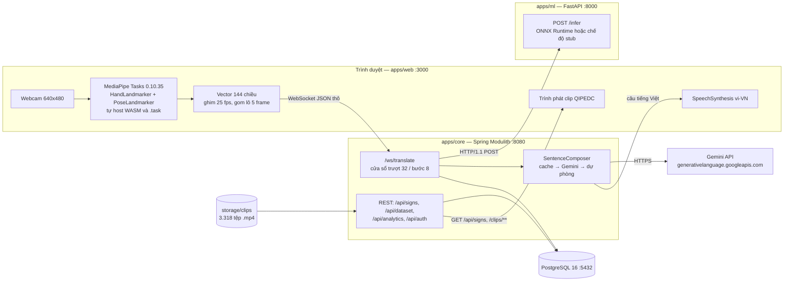
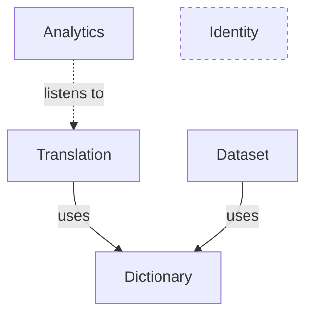
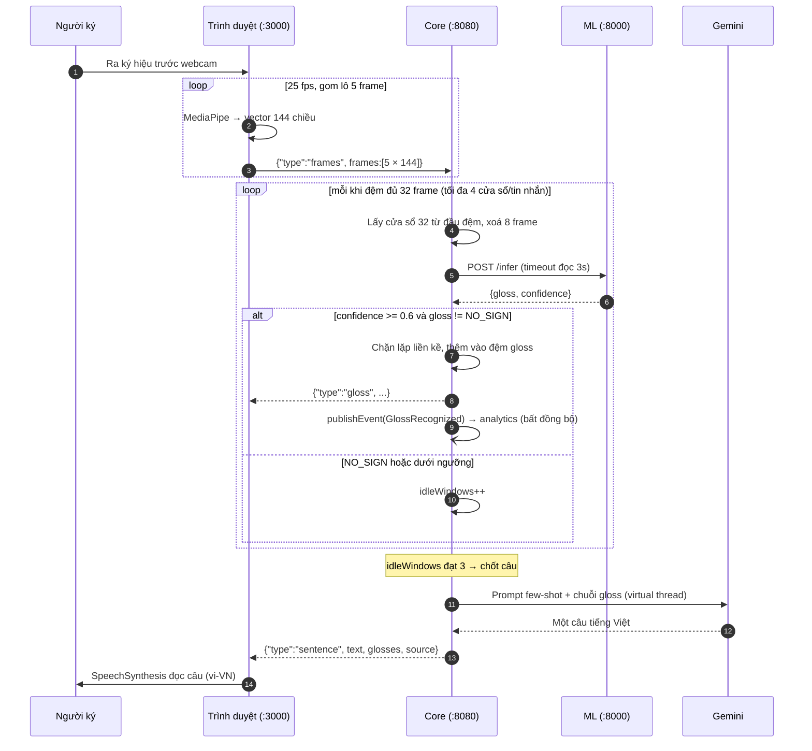

# Chương 3 — Kiến trúc hệ thống

Chương này mô tả kiến trúc của SignBridge ở mức đủ chi tiết để một người khác dựng lại
được hệ thống. Nguyên tắc trình bày: mọi con số nêu ra đều dẫn kèm đường dẫn tệp và số
dòng trong kho mã, để hội đồng có thể mở đúng chỗ mà đối chiếu. Chỗ nào chưa có số liệu
thật thì ghi rõ `[CẦN SỐ LIỆU]` thay vì điền tạm.

---

## 3.1. Tổng quan ba tầng

Hệ thống gồm ba tiến trình chạy độc lập, cộng thêm một cơ sở dữ liệu quan hệ:

| Tầng | Công nghệ | Cổng | Vai trò |
|---|---|---|---|
| `apps/web` | Next.js 16.2.12, React 19.2.4 | 3000 | Giao diện, webcam, **trích đặc trưng MediaPipe ngay trong trình duyệt**, phát âm thanh |
| `apps/core` | Spring Boot 4.1.0, Spring Modulith 2.1.0, Java 21 | 8080 | Modular monolith 5 module: WebSocket phiên dịch, REST từ điển/thu mẫu/thống kê, xác thực |
| `apps/ml` | FastAPI (>=0.115), uvicorn, onnxruntime (>=1.28) | 8000 | Một dịch vụ mỏng duy nhất: nhận mảng toạ độ, trả nhãn |
| PostgreSQL | `postgres:16-alpine` | 5432 | Lưu `signs`, `users`, `sample_records`, `gloss_usages` |

Nguồn kiểm chứng phiên bản: `apps/core/pom.xml` (dòng 8, 30, 31), `apps/web/package.json`
(dòng 12, 17, 20-21), `apps/ml/requirements.txt`, `docker-compose.yml`. Nguồn kiểm chứng
cổng: `apps/core/src/main/resources/application.yml` (`server.port: 8080`,
`signbridge.ml.base-url: http://localhost:8000`), `docker-compose.yml` (5432),
`apps/core/src/main/java/vn/signbridge/translation/WebSocketConfig.java` dòng 22.



Ba giao thức nối ba tầng: **WebSocket văn bản thô** giữa trình duyệt và core,
**HTTP/1.1** giữa core và dịch vụ ML, **HTTP/REST + tài nguyên tĩnh** cho phần từ điển.
Không dùng STOMP trên WebSocket: luồng landmark là điểm-tới-điểm, tần suất cao, không cần
định tuyến đích cũng không cần broker
(`translation/LandmarkWebSocketHandler.java` dòng 20-21). Việc ép HTTP/1.1 ở
`MlClient.java` (dòng 30-35) không phải tuỳ chọn thẩm mỹ: `HttpClient` mặc định của JDK gửi
`Upgrade: h2c` kèm chunked encoding mà `h11` của uvicorn từ chối thẳng.

---

## 3.2. Modular monolith: năm module và ranh giới được kiểm chứng

Core được chia thành năm module Spring Modulith, mỗi module khai báo bằng một tệp
`package-info.java` dưới `apps/core/src/main/java/vn/signbridge/`:

| Module | Trách nhiệm | Aggregate root |
|---|---|---|
| `identity` | Tài khoản, đăng nhập JWT, phân quyền ADMIN/CONTRIBUTOR/USER | `User` |
| `dictionary` | Từ điển VSL: gloss, nghĩa tiếng Việt, danh mục, clip mẫu | `Sign` |
| `translation` | Pipeline thời gian thực: landmark → cửa sổ trượt → ML → đệm gloss → ghép câu | (không có entity) |
| `dataset` | Thu mẫu ký hiệu: ai quay, ký hiệu nào, lưu tệp huấn luyện | `SampleRecord` |
| `analytics` | Lắng nghe `GlossRecognized`, ghi `gloss_usages`, trả số liệu gộp | `GlossUsage` |

Đồ thị phụ thuộc dưới đây **không phải do tác giả vẽ tay** mà chép lại từ
`docs/report/kien-truc/components.puml` dòng 28-30 — tệp này do
`ModularityTests.generateDocumentation()` sinh ra từ chính mã nguồn:



Ba nhận xét rút ra từ đồ thị này:

**Thứ nhất, `analytics` không gọi `translation`.** Cạnh giữa hai module là *listens to*
chứ không phải *uses*: `GlossStatsListener` gắn `@ApplicationModuleListener` lên sự kiện
`GlossRecognized` (`analytics/GlossStatsListener.java` dòng 37-38). Hệ quả kỹ thuật là việc
ghi thống kê nằm **ngoài đường trễ** của phiên dịch — nếu ghi cơ sở dữ liệu chậm hoặc lỗi,
người dùng vẫn thấy gloss và câu bình thường. Cấu hình kèm theo tại `application.yml`
dòng 26-33: `completion-mode: delete` để bảng `event_publication` không phình vô hạn (mỗi
gloss nhận diện sinh một dòng, ngay trên hot path), và
`republish-outstanding-events-on-restart: true` để sự kiện lỗi giữa chừng được phát lại khi
khởi động lại thay vì mất vĩnh viễn.

**Thứ hai, bề mặt công khai xuyên module rất hẹp.** Chỉ có hai kiểu được khai báo `public`:
interface `dictionary.SignCatalog` với đúng hai phương thức `existsByGloss` và `meaningOf`,
và record `translation.GlossRecognized(sessionId, gloss, confidence, at)`. Mọi lớp còn lại
— kể cả controller và repository — đều package-private. `translation` dùng `SignCatalog` để
ghép câu dự phòng (`SentenceComposer.java` dòng 19, 137); `dataset` dùng nó để kiểm gloss có
thật trước khi ghi tệp mẫu (`DatasetController.java`).

**Thứ ba, `identity` không có cạnh phụ thuộc nào.** Đây là lý do `components.puml` chỉ vẽ
bốn khối: module không tham gia quan hệ nào thì bộ sinh sơ đồ bỏ qua. Cần nói rõ điều này
trong báo cáo để tránh hiểu nhầm rằng hệ thống chỉ có bốn module. Bản thân cấu hình bảo mật
(`vn/signbridge/SecurityConfig.java`) nằm ở gói gốc, được chú thích thẳng là "hạ tầng —
không thuộc module nào" (dòng 20).

### Ranh giới trở thành thứ CI kiểm được

Điểm mấu chốt của lựa chọn Spring Modulith là ranh giới kiến trúc không nằm trong tài liệu
mà nằm trong bộ kiểm thử. `apps/core/src/test/java/vn/signbridge/ModularityTests.java` chỉ
có hai phương thức: `modules.verify()` và `new Documenter(modules).writeDocumentation()`.
Phương thức thứ nhất làm bản dựng **thất bại** nếu một module import lớp nội bộ của module
khác; phương thức thứ hai sinh sơ đồ C4 và module canvas vào `target/spring-modulith-docs`,
từ đó chép sang `docs/report/kien-truc/`. Nói cách khác, sơ đồ trong chương này không thể
lệch với mã nguồn quá một lần chạy `mvn test`.

### Vì sao không microservices

Với một đồ án do một người thực hiện, chia microservices sẽ đổi một vấn đề dễ (giữ kỷ luật
gói) lấy nhiều vấn đề khó: điều phối nhiều tiến trình, nhất quán dữ liệu phân tán, tracing
xuyên dịch vụ, và nhiều lần triển khai cho mỗi thay đổi. Modular monolith giữ được lợi ích
mà đồ án thực sự cần — một tiến trình, một cơ sở dữ liệu, một lệnh chạy — trong khi ranh
giới vẫn bị trình biên dịch và bộ kiểm thử ép tuân thủ. Nếu sau này cần tách một module
thành dịch vụ riêng, phần việc còn lại chủ yếu là đổi transport, vì các module vốn đã không
gọi thẳng vào nội bộ của nhau. Ngoại lệ duy nhất được tách tiến trình là `apps/ml`, và lý do
tách là bắt buộc về mặt hệ sinh thái: PyTorch và ONNX Runtime chỉ có ở Python.

---

## 3.3. Luồng chiều thuận: ký hiệu → tiếng nói

**Bước 1 — Thu hình và trích đặc trưng trong trình duyệt.**
`useVisionPipeline.ts` gọi `getUserMedia({ video: { width: 640, height: 480 } })` (dòng 62-63)
và chạy vòng lặp `requestAnimationFrame`. Hai bộ nhận dạng được tạo trong `landmarks.ts`:
`HandLandmarker` với `numHands: 2` và `PoseLandmarker` với `numPoses: 1`, cả hai ở
`runningMode: "VIDEO"`, thử delegate GPU trước rồi tự lùi về CPU (dòng 30-54). Tệp WASM và
tệp `.task` được tự host trong `apps/web/public/` chứ không tải từ CDN.

**Bước 2 — Vector đặc trưng 144 chiều.** Bố cục do `landmarks.ts` dòng 15, 60-83 quy định:

```
frame[0..62]    tay TRÁI   : 21 điểm × (x, y, z)
frame[63..125]  tay PHẢI   : 21 điểm × (x, y, z)
frame[126..143] thân trên  : 6 điểm pose × (x, y, z)
                pose index [11, 12, 13, 14, 15, 16] = vai, khuỷu, cổ tay (trái + phải)
```

Tay không xuất hiện trong khung hình thì 63 số tương ứng để nguyên giá trị 0 (mảng khởi tạo
bằng `fill(0)`); trái/phải phân biệt bằng `handednesses[i][0].categoryName === "Left"`. Toạ
độ làm tròn 4 chữ số qua hàm `r4` — chú thích dòng 57 ghi rõ mục đích là giảm khoảng ba lần
kích thước gói tin. Con số 144 được lặp lại và ràng buộc chéo ở bốn nơi:
`training/model/dataset.py` dòng 29, `apps/ml/app/main.py` dòng 21,
`LandmarkWebSocketHandler.java` dòng 42, `DatasetController.java` dòng 42.

Nhịp trích đặc trưng được **ghim ở 25 fps** (`useVisionPipeline.ts` dòng 24, 102) chứ không
chạy theo nhịp màn hình. Đây là quyết định chống lệch phân bố: màn hình 120 Hz sẽ sinh chuỗi
frame "nhanh gấp nhiều lần" so với video huấn luyện, khiến model đúng vẫn cho kết quả sai.
Cùng con số này được ghi vào `labels.json` dưới khoá `fps_hint` (`train.py` dòng 220).

**Bước 3 — Truyền tải.** `TranslateDemo.tsx` gom đủ `FRAME_BATCH = 5` frame rồi mới gửi
(dòng 14, 50-53). Giao thức là JSON thô, khai báo ở docblock
`LandmarkWebSocketHandler.java` dòng 23-26: client gửi `{"type":"frames","frames":[...]}`
hoặc `{"type":"flush"}`; server trả `{"type":"gloss",...}` hoặc `{"type":"sentence",...}`.

**Bước 4 — Cửa sổ trượt phía server.** Các hằng số tại
`LandmarkWebSocketHandler.java` dòng 40-48: `WINDOW = 32` frame (khoảng 1,28 giây ở 25 fps),
`STRIDE = 8` (chồng lấn 75%), `MAX_BATCH_FRAMES = 60`, `MAX_BUFFERED_FRAMES = 4 × WINDOW = 128`,
`MAX_WINDOWS_PER_MESSAGE = 4`. Vòng lặp luôn lấy cửa sổ từ **đầu** đệm rồi xoá `STRIDE` frame
và lặp lại cho tới khi không đủ frame (dòng 106-117); chú thích dòng 28-30 giải thích vì sao
xử lý một cửa sổ mỗi tin nhắn là sai. Vì `/ws/translate` là endpoint công khai, mọi ràng buộc
đầu vào phải kiểm ngay tại đây: lô quá lớn hoặc frame sai số chiều làm phiên bị đóng với mã
1008 `POLICY_VIOLATION`.

**Bước 5 — Suy luận.** `MlClient` gửi `POST /infer` với timeout kết nối 2 giây và timeout đọc
3 giây; lỗi trả về `Optional.empty()` và cửa sổ đó bị bỏ qua thay vì làm sập phiên.

**Bước 6 — Lọc và phát hiện nghỉ tay.** `TranslationService.java` dòng 34-41:
`CONFIDENCE_THRESHOLD = 0.6`, `IDLE_WINDOWS_TO_FINALIZE = 3`, `MAX_GLOSSES_PER_SENTENCE = 20`.
Vì các cửa sổ chồng lấn nhau nên cùng một ký hiệu sẽ xuất hiện nhiều lần liên tiếp; dòng
81-83 chặn gloss lặp liền kề. Ba cửa sổ liên tiếp cho `NO_SIGN` (hoặc dưới ngưỡng tin cậy)
được hiểu là người ký đã dừng, và câu được chốt. Việc phát sự kiện `GlossRecognized` chỉ
được bọc trong `TransactionTemplate` quanh đúng lời gọi `publishEvent`, **không** đặt
`@Transactional` lên cả phương thức — chú thích dòng 26-28 nêu lý do: giao dịch sẽ giữ một
kết nối Hikari suốt lời gọi HTTP sang dịch vụ ML.

**Bước 7 — Phát âm.** `speech.ts` dùng `SpeechSynthesisUtterance` với `lang = "vi-VN"`,
`rate = 0.95`, và hàm `warmUpVoices()` gọi sớm vì trình duyệt nạp danh sách giọng bất đồng bộ.



Vì sao trích đặc trưng ở trình duyệt chứ không gửi video lên server? Ba lý do, được ghi
trong `PLAN.md` dòng 66. (a) Server không phải giải mã và xử lý video, chỉ nhận JSON toạ độ;
(b) **video không rời khỏi máy người dùng** — đây là lập luận về quyền riêng tư, đặc biệt
đáng kể khi ứng dụng hướng tới bối cảnh y tế; (c) chi phí hạ tầng khi triển khai thấp hơn
hẳn. Cái giá phải trả là hệ thống phụ thuộc vào năng lực máy khách và vào việc quy trình
huấn luyện phải dùng **đúng** hai tệp `.task` mà trình duyệt dùng (`training/README.md`
dòng 17-26 cảnh báo rằng dùng API `mp.solutions.holistic` cũ sẽ khiến model rớt độ chính
xác một cách âm thầm).

---

## 3.4. Luồng chiều ngược: tiếng Việt → ký hiệu

Chiều ngược phục vụ tình huống người nghe muốn nói với người Điếc. Thuật toán là
**khớp cụm dài nhất** (greedy longest match) với `MAX_PHRASE_WORDS = 4`: tại mỗi vị trí, hệ
thống thử cụm 4 từ, rồi 3, rồi 2, rồi 1. Lý do ghi tại `SignComposer.java` dòng 17-21: cụm
"đau bụng" phải được nhận nguyên cụm chứ không tách thành "đau" + "bụng". Hàm `normalize()`
chuẩn hoá NFC, hạ chữ thường, bỏ dấu câu, gộp khoảng trắng, nhưng **giữ nguyên dấu tiếng
Việt** (dòng 70-77).

Thuật toán được cài hai lần một cách có chủ đích. Phía server, `SignComposer` lộ ra
`GET /api/signs/compose?text=...` và trả về `ComposeResult(items, missing)` — danh sách
`missing` là cam kết trung thực với người dùng: từ nào **không** dịch được phải nói ra.
Phía client, `SpeakTool.tsx` tải một lần `GET /api/signs` rồi tự dựng hai bảng tra và lặp lại
đúng logic `normalize` (chú thích dòng 72 ghi rõ ràng buộc phải khớp server).

Lý do phải khớp ở client là **cơ chế đánh vần**. Từ không có trong từ điển được tách thành
từng ký tự và tra trong `letterMap` — bảng chữ cái ngón tay, dựng từ chính các ký hiệu có
nghĩa dài đúng một ký tự trong kho QIPEDC; ký tự có dấu không tìm thấy clip thì lùi về
`stripDiacritics` (đ→d, tách NFD rồi bỏ dấu). Vì một câu có thể trộn lẫn từ-có-ký-hiệu và
từ-phải-đánh-vần, chỉ khi khớp ở client mới giữ được đúng **thứ tự** của cả câu
(`SpeakTool.tsx` dòng 32-34). Một chi tiết quan trọng ở dòng 136-139: bảng cụm **chỉ nhận
những ký hiệu có `clipUrl`** — từ có trong từ điển nhưng thiếu clip mà vẫn nhận vào bảng thì
nhánh đánh vần không bao giờ chạy và trình phát sẽ đứng im.

Nguồn clip là **kho từ điển ký hiệu quốc gia QIPEDC** (`qipedc.moet.gov.vn`, dự án của Bộ
Giáo dục và Đào tạo), lấy qua tập dữ liệu `Lakeserl/SignConnect` trên Hugging Face; docstring
`training/preprocess/import_signconnect.py` dòng 3-5 ghi nguồn có 4.362 video, hậu tố B/N/T
là biến thể vùng miền Bắc/Nam/Trung. Script chuẩn hoá tên gloss sang ASCII, ưu tiên biến thể
miền Bắc, và đi qua **API thật** của backend nên đường nhập liệu giống hệt đường quản trị
viên dùng. Kết quả kiểm đếm trên đĩa tại thời điểm viết: **3.318 tệp `.mp4`** trong
`storage/clips`, toàn bộ đúng định dạng mp4.

Một phát hiện về mặt ngôn ngữ học đáng ghi nhận, có ghi lại tại `SpeakTool.tsx` dòng 58-61:
từ điển quốc gia không có ký hiệu rời cho "tôi", "cảm ơn", "bác sĩ", "hôm nay". Riêng trường
hợp "tôi" không phải thiếu sót của kho dữ liệu mà là đặc điểm của VSL — ngôi thứ nhất được
diễn đạt bằng động tác chỉ vào mình chứ không có ký hiệu từ vựng. Đây chính là loại tri thức
mà một hệ thống dịch từ-sang-từ thuần tuý sẽ bỏ sót.

---

## 3.5. Ba lớp phòng thủ ở khâu ghép câu

Ngữ pháp VSL khác tiếng Việt nói: thiếu hư từ, trật tự từ khác. Chuỗi
`XIN_CHAO / BAC_SI / TOI / DAU / KHAM_BENH` không phải là một câu tiếng Việt. Vì vậy khâu
ghép câu là một bước xử lý ngôn ngữ thật sự. Cách làm theo tiền lệ Spotter+GPT — mã nguồn
ghi mã định danh arXiv 2403.10434 (`SentenceComposer.java` dòng 26) [CẦN TRÍCH DẪN cho mục
tài liệu tham khảo đầy đủ: tên bài, tác giả, năm] — dùng prompt few-shot và **không**
fine-tune. Fine-tune bất khả thi ở quy mô đồ án vì không tồn tại kho ngữ liệu song song
gloss ↔ câu tiếng Việt.

`SentenceComposer` gọi Gemini `gemini-flash-latest` với `temperature = 0.2`,
`maxOutputTokens = 500`, timeout kết nối 3 giây và timeout đọc 8 giây
(`application.yml` dòng 52-58; `SentenceComposer.java` dòng 73-83, 119). Prompt hệ thống là
một text block sáu ví dụ (dòng 41-52). Lời gọi chạy trên **virtual thread** (Java 21) để
không chiếm giữ thread WebSocket.

Ba lớp phòng thủ, theo đúng thứ tự trong `compose()` (dòng 93-113):

1. **Cache LRU 200 mục** khoá theo chuỗi gloss nối bằng `/`. Câu lặp lại trả về tức thì và
   không tốn quota. Nguồn kết quả được đánh dấu `cache`.
2. **Gọi Gemini.** Thành công thì lấy dòng đầu tiên của phản hồi, ghi vào cache, đánh dấu
   nguồn `llm`.
3. **Ghép dự phòng từ từ điển.** Không có API key, hoặc lời gọi ném lỗi, hoặc hết thời gian
   chờ, thì hệ thống ghép nghĩa tiếng Việt của từng gloss qua `SignCatalog.meaningOf`, viết
   hoa chữ đầu và thêm dấu chấm (dòng 135-143). Kết quả thô nhưng luôn hiểu được, đánh dấu
   nguồn `fallback`.

Đây là lý do buổi demo không thể chết vì mạng: nhánh 3 không phụ thuộc Internet, không phụ
thuộc key, và chỉ đọc dữ liệu đã có sẵn trong cơ sở dữ liệu. Trường `source` được trả thẳng
về giao diện để người xem biết câu vừa nghe đến từ đâu — một dạng minh bạch mà hệ thống dùng
LLM nên có.

Chất lượng khâu này đã được đo bằng `training/eval/sentence_eval.py`, kết quả sinh tự động
vào `docs/report/data/sentence-eval.md`: trên bộ 4 chuỗi gloss, phủ nội dung 4/4, không bịa
thêm 3/4, đúng dạng một câu 4/4; độ trễ gọi LLM trung vị 2.920 ms (nhỏ nhất 2.432 ms, lớn
nhất 3.433 ms, đo qua Internet). Bộ kiểm thử 4 ca là quá nhỏ để kết luận thống kê — chi tiết
và hạn chế bàn ở Chương 4.

---

## 3.6. Mô hình SignTransformer

Kiến trúc định nghĩa tại `training/model/model.py`:

```
SignTransformer(num_classes, input_dims=144, d_model=192, num_layers=4,
                num_heads=4, max_len=64, dropout=0.2)
  input_proj    : Linear(144 → 192) + LayerNorm(192)
  pos_embedding : Parameter (1, 64, 192), khởi tạo trunc_normal_(std=0.02)
  encoder       : TransformerEncoder × 4 lớp
                  (d_model=192, nhead=4, dim_feedforward=384, norm_first=True)
  pooling       : masked mean pooling — (h × mask).sum(1) / mask.sum(1).clamp(min=1)
  head          : LayerNorm(192) → Dropout(0.2) → Linear(192 → num_classes)
```

Docstring dòng 3-6 ghi lý do chọn: transformer trên landmark là điểm cân bằng tốt nhất giữa
độ chính xác và độ phức tạp ở quy mô 100-200 gloss, với SPOTER làm mốc và kiến trúc
1D-CNN + Transformer của đội hạng nhất Kaggle GISLR làm đích nâng cấp; hướng GCN bị loại vì
phức tạp hơn nhiều mà lợi ích nhỏ ở quy mô này. [CẦN TRÍCH DẪN: SPOTER và giải pháp GISLR
mới chỉ được nêu tên trong mã nguồn, chưa có mục tài liệu tham khảo đầy đủ.]

### Xử lý lớp NO_SIGN — bốn tầng

Bài toán quan trọng nhất khi chuyển từ phân loại clip sang nhận diện liên tục là: hệ thống
phải biết lúc nào **không có** ký hiệu nào cả. SignBridge xử lý ở bốn tầng:

1. **Lớp thứ (C+1).** `num_classes = len(labels) + 1` (`train.py` dòng 126), và nhãn
   `NO_SIGN` được nối vào cuối danh sách (`dataset.py` dòng 80).
2. **Tổng hợp mẫu từ đoạn liên tục.** `_boundary_runs` chỉ lấy các **run liên tục** frame
   không-tay ở đầu và cuối video, với `MIN_RUN = 4` (`dataset.py` dòng 33, 52-60). Pool được
   lấy ngẫu nhiên có seed (`seed = 42`, `no_sign_pool_size = 400`) trên toàn bộ tập mẫu chứ
   không lấy "N tệp đầu tiên" theo thứ tự hệ thống tệp. Docstring dòng 13 giải thích vì sao
   không lấy frame rời rạc ở giữa video và không ghép độc lập: cả hai cách đều tạo ra chuỗi
   pose nhảy loạn, không giống dữ liệu thật.
3. **Đánh giá tách bạch.** Mẫu NO_SIGN tổng hợp chỉ được trộn vào tập **train**; loader
   val/test không nhận (`train.py` dòng 112-120). Chỉ số NO_SIGN recall đo riêng trên một
   batch idle seed cứng. Nếu trộn chung, top-1 sẽ bị thổi phồng bởi một lớp quá dễ.
4. **Ràng buộc lúc chạy thật.** Spring coi `NO_SIGN` hoặc confidence dưới 0,6 là "không nhận
   diện" và tăng `idleWindows`; đủ 3 lần thì chốt câu (`TranslationService.java` dòng 68-78).

Ngoài top-1/top-5 trên mẫu thật và NO_SIGN recall, `train.py` còn đo **streaming top-1**:
trượt cửa sổ 32 với `SERVE_STRIDE = 8` trên cả chuỗi rồi vote đa số các cửa sổ không phải
NO_SIGN (dòng 34, 62-77). Hằng số 8 được chú thích thẳng là "khớp `LandmarkWebSocketHandler`
bên Spring" — nghĩa là chỉ số này mô phỏng đúng cách hệ thống được phục vụ thật, và là con
số trung thực nhất trong ba nhóm.

### Đường đi PyTorch → ONNX → onnxruntime

`ExportWrapper` bọc model, bỏ mask và thêm `softmax(dim=-1)` (`model.py` dòng 64-72). Bước
export không ghim opset (`train.py` dòng 212-217) với chú thích rằng exporter dùng bản mới
nhất nó hỗ trợ và môi trường phục vụ chạy `onnxruntime >= 1.28`; `dynamic_axes` chỉ mở chiều
batch. Sản phẩm gồm `sign_model.onnx` và `labels.json` chứa
`{labels, window: 32, dims: 144, fps_hint: 25, val_top1, test_top1, test_streaming_top1,
test_no_sign_recall, run}` (dòng 219-223). Chép hai tệp này vào `apps/ml/model/` là xong.

### Chế độ kép của apps/ml

`apps/ml/app/main.py` tự chọn chế độ lúc khởi động (dòng 58-63): nếu thư mục model có đủ
`sign_model.onnx` và `labels.json` thì nạp ONNX Runtime, ngược lại chạy **stub** trả gloss
giả trong tập 8 nhãn `XIN_CHAO, CAM_ON, TOI, BAN, BAC_SI, DAU, KHAM_BENH, GIUP_DO`, với
frame toàn 0 luôn cho `NO_SIGN`. Điểm thiết kế đáng nói: **contract của `/infer` không đổi
giữa hai chế độ**, nên Spring core không cần biết bên kia là model thật hay stub và không
phải sửa dòng nào khi thay. Ở chế độ model thật, `/infer` từ chối bằng HTTP 422 nếu số cửa
sổ khác `window` (dòng 48-51) — vì `ExportWrapper` đã bỏ mask với tiền đề "luôn nhận đủ
window frame", đệm 0 âm thầm sẽ cho kết quả vô nghĩa mà không ai biết. Endpoint `/health`
công bố `window` để phía Spring đối chiếu contract.

**Trạng thái hiện tại: `[CẦN SỐ LIỆU]`.** Kho mã chưa có thư mục `apps/ml/model/`, chưa có
`labels.json`, và không có bất kỳ con số độ chính xác nào; `docs/report/README.md` dòng 41-42
xác nhận Chương 4 đang chờ quyền truy cập tập dữ liệu. Toàn bộ pipeline hiện chạy ở chế độ
stub. Số lớp thật, top-1/top-5, NO_SIGN recall và streaming top-1 đều là `[CẦN SỐ LIỆU]`.

---

## 3.7. Bảo mật

Xác thực dùng **JWT tự phát hành**, ký HS256, thời hạn **24 giờ**
(`identity/TokenService.java` dòng 19, 33). Token mang claim `role`, được
`JwtGrantedAuthoritiesConverter` chuyển thành quyền `ROLE_ADMIN` / `ROLE_CONTRIBUTOR` /
`ROLE_USER` (`SecurityConfig.java` dòng 58-66). Ba vai được định nghĩa tại
`identity/Role.java`: ADMIN quản trị từ điển và duyệt dữ liệu, CONTRIBUTOR góp mẫu ký hiệu,
USER dùng chức năng phiên dịch.

Bảng phân quyền thực tế (`SecurityConfig.java` dòng 38-52):

| Nhóm đường dẫn | Quyền |
|---|---|
| `/api/auth/**`, `/ws/**`, `/actuator/health`, `/error` | công khai |
| `GET /api/signs/**`, `/clips/**`, `/api/dataset/stats`, `GET /api/analytics/**` | công khai |
| `POST /api/dataset/samples` | công khai (giai đoạn thu mẫu) |
| `POST`/`PUT`/`DELETE /api/signs/**` | ADMIN |
| `/actuator/**` (còn lại) | ADMIN |
| còn lại | cần đăng nhập |

Bốn quyết định đáng nói:

**`/error` phải mở.** Đây là dispatch nội bộ của Spring MVC khi controller trả 4xx/5xx.
Không đưa vào `permitAll` thì mọi lỗi kiểm tra dữ liệu bị filter chain biến thành 401, che
mất nguyên nhân thật (chú thích dòng 39-41 ghi rõ lỗi này tìm ra qua kiểm thử E2E).

**`/actuator/**` chỉ dành cho ADMIN.** Endpoint `modulith`, `info`, `env` phơi bày cấu trúc
nội bộ của ứng dụng; một tài khoản USER tự đăng ký không được phép xem.

**Đăng ký công khai luôn chỉ cấp vai USER.** Quy ước "người đăng ký đầu tiên là admin" đã bị
loại bỏ; ADMIN chỉ đến từ bootstrap cấu hình, và bootstrap không tự nâng quyền tài khoản đã
tồn tại (`identity/AuthController.java`, `identity/AdminBootstrap.java`).

**Endpoint công khai phải có trần ghi.** Vì `/ws/translate` không cần đăng nhập,
`GlossStatsListener` giới hạn `MAX_ROWS_PER_SESSION = 300` dòng mỗi phiên (dòng 19-22,
39-46): không có trần thì một script cắm socket chạy cả đêm sẽ vừa phình bảng vừa bẻ cong số
liệu trên dashboard công khai. Tương tự, `LandmarkWebSocketHandler` chặn lô quá 60 frame và
frame sai số chiều ngay tại lớp vào.

CORS chỉ cho phép `http://localhost:3000`, khai báo hai lần cho hai kênh khác nhau:
`corsConfigurationSource()` cho REST (`SecurityConfig.java` dòng 71) và
`setAllowedOrigins("http://localhost:3000")` cho WebSocket (`WebSocketConfig.java` dòng 22).

---

## 3.8. Hạn chế đã biết của kiến trúc hiện tại

Trình bày trung thực để hội đồng thấy tác giả nắm được giới hạn của chính mình:

- **Chưa có model thật.** Toàn hệ thống chạy chế độ stub; mọi chỉ số nhận diện là
  `[CẦN SỐ LIỆU]`.
- **Lược đồ cơ sở dữ liệu dùng `ddl-auto: update`.** Đây là cấu hình chỉ hợp lệ cho môi
  trường phát triển; `application.yml` dòng 23 tự ghi chú sẽ chuyển sang Flyway migration.
- **Cấu hình mặc định còn chứa bí mật dùng cho phát triển.** Khoá JWT và mật khẩu quản trị
  trong `application.yml` được đánh dấu DEV ONLY và phải đặt lại qua biến môi trường khi
  triển khai thật.
- **Chưa vote nhiều cửa sổ trước khi chốt gloss.** Hiện chỉ chặn gloss lặp liền kề
  (`TranslationService.java` dòng 81-83); cơ chế vote đa số mới tồn tại ở khâu đánh giá
  ngoại tuyến (`train.py::evaluate_streaming`). Đây là chênh lệch có chủ ý giữa `PLAN.md` và
  bản cài đặt, sẽ nêu lại ở phần hướng phát triển.
- **TTS dùng `SpeechSynthesis` của trình duyệt**, chất lượng giọng phụ thuộc hệ điều hành;
  bản giọng neural sinh sẵn phía server là mục tiêu giai đoạn sau (`speech.ts` dòng 4-6).
- **Độ trễ end-to-end chưa đo.** `[CẦN SỐ LIỆU]` cho p50/p95 từ lúc ra ký hiệu tới lúc nghe
  được câu.
- **Một số chú thích trong mã đã lạc hậu so với cài đặt** — ví dụ `dictionary/package-info.java`
  còn ghi clip "lưu trên MinIO" trong khi MinIO đã bị loại bỏ khỏi `docker-compose.yml`
  (kho MinIO community bị lưu trữ tháng 04/2026) và clip thực tế nằm trên filesystem
  (`dictionary/ClipStorage.java` dòng 17-18).
