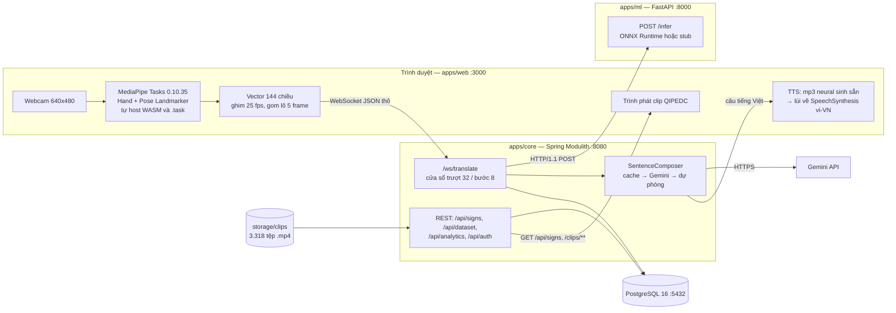
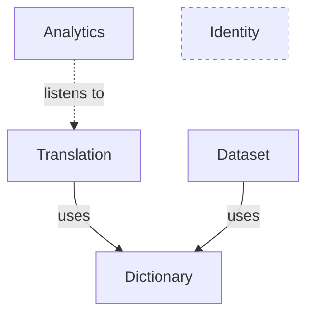
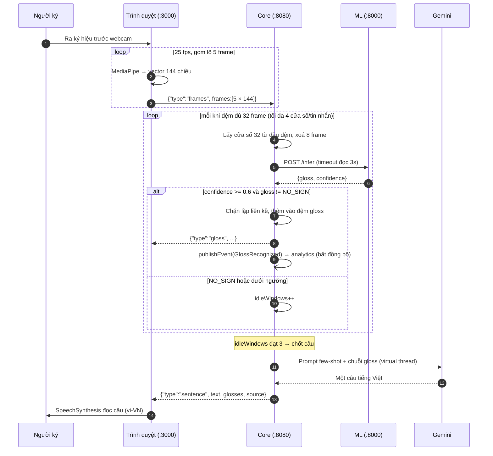

# Chương 3 — Kiến trúc hệ thống

Chương này mô tả kiến trúc SignBridge ở mức đủ để dựng lại hệ thống. Mọi con số đều dẫn kèm
đường dẫn tệp và số dòng trong kho mã; chỗ chưa có dữ liệu thật thì ghi `[CẦN SỐ LIỆU]`.

---

## 3.1. Tổng quan ba tầng

| Tầng | Công nghệ | Cổng | Vai trò |
|---|---|---|---|
| `apps/web` | Next.js 16.2.12, React 19.2.4 | 3000 | Giao diện, webcam, **trích đặc trưng MediaPipe trong trình duyệt**, phát âm thanh |
| `apps/core` | Spring Boot 4.1.0, Spring Modulith 2.1.0, Java 21 | 8080 | Modular monolith 5 module: WebSocket phiên dịch, REST từ điển/thu mẫu/thống kê, xác thực |
| `apps/ml` | FastAPI (>=0.115), uvicorn, onnxruntime (>=1.28) | 8000 | Dịch vụ mỏng: nhận mảng toạ độ, trả nhãn |
| PostgreSQL | `postgres:16-alpine` | 5432 | `signs`, `users`, `sample_records`, `gloss_usages` |

Kiểm chứng phiên bản: `apps/core/pom.xml` (dòng 8, 30, 31), `apps/web/package.json` (dòng 12,
17, 20-21), `apps/ml/requirements.txt`, `docker-compose.yml`. Kiểm chứng cổng:
`apps/core/src/main/resources/application.yml`, `docker-compose.yml`,
`translation/WebSocketConfig.java` dòng 22.



Ba giao thức nối ba tầng: **WebSocket văn bản thô** (web ↔ core), **HTTP/1.1** (core ↔ ML),
**REST + tài nguyên tĩnh** cho từ điển. Không dùng STOMP vì luồng landmark là điểm-tới-điểm,
tần suất cao, không cần định tuyến đích cũng không cần broker
(`translation/LandmarkWebSocketHandler.java` dòng 20-21). Ép HTTP/1.1 trong `MlClient.java`
(dòng 30-35) là bắt buộc: `HttpClient` mặc định của JDK gửi `Upgrade: h2c` kèm chunked
encoding mà `h11` của uvicorn từ chối.

---

## 3.2. Modular monolith: năm module và ranh giới được kiểm chứng

Năm module khai báo bằng năm tệp `package-info.java` dưới
`apps/core/src/main/java/vn/signbridge/`:

| Module | Trách nhiệm | Aggregate root |
|---|---|---|
| `identity` | Tài khoản, đăng nhập JWT, phân quyền ADMIN/CONTRIBUTOR/USER | `User` |
| `dictionary` | Từ điển VSL: gloss, nghĩa tiếng Việt, danh mục, clip mẫu | `Sign` |
| `translation` | Landmark → cửa sổ trượt → ML → đệm gloss → ghép câu | (không có entity) |
| `dataset` | Thu mẫu ký hiệu: ai quay, ký hiệu nào, lưu tệp huấn luyện | `SampleRecord` |
| `analytics` | Lắng nghe `GlossRecognized`, ghi `gloss_usages`, trả số liệu gộp | `GlossUsage` |

Đồ thị dưới đây **không vẽ tay** mà chép từ `docs/report/kien-truc/components.puml`
dòng 28-30, tệp do `ModularityTests.generateDocumentation()` sinh ra từ mã nguồn:



**`analytics` không gọi `translation`.** Cạnh giữa hai module là *listens to*, không phải
*uses*: `GlossStatsListener` gắn `@ApplicationModuleListener` lên `GlossRecognized`
(`analytics/GlossStatsListener.java` dòng 37-38). Việc ghi thống kê vì thế nằm **ngoài đường
trễ** của phiên dịch — ghi cơ sở dữ liệu chậm hay lỗi thì người dùng vẫn thấy gloss và câu
bình thường. Hai cấu hình đi kèm tại `application.yml` dòng 26-33: `completion-mode: delete`
để bảng `event_publication` không phình vô hạn (mỗi gloss sinh một dòng, ngay trên hot path),
và `republish-outstanding-events-on-restart: true` để sự kiện lỗi giữa chừng được phát lại.

**Bề mặt công khai xuyên module rất hẹp:** chỉ interface `dictionary.SignCatalog`
(`existsByGloss`, `meaningOf`) và record `translation.GlossRecognized(sessionId, gloss,
confidence, at)`. Mọi lớp còn lại, kể cả controller và repository, đều package-private.
`identity` không có cạnh phụ thuộc nào nên bộ sinh sơ đồ bỏ qua và `components.puml` chỉ vẽ
bốn khối — cần nêu rõ để tránh hiểu nhầm hệ thống chỉ có bốn module. Cấu hình bảo mật
(`vn/signbridge/SecurityConfig.java` dòng 20) nằm ở gói gốc, tự chú thích là "hạ tầng — không
thuộc module nào".

**Ranh giới trở thành thứ CI kiểm được.** `ModularityTests.java` chỉ có hai phương thức:
`modules.verify()` làm bản dựng **thất bại** nếu một module import lớp nội bộ của module khác,
và `new Documenter(modules).writeDocumentation()` sinh sơ đồ C4 cùng module canvas. Sơ đồ
trong chương này vì thế không thể lệch với mã nguồn quá một lần chạy `mvn test`.

**Vì sao không microservices.** Với đồ án một người, chia microservices là đổi một vấn đề dễ
(giữ kỷ luật gói) lấy nhiều vấn đề khó: điều phối nhiều tiến trình, nhất quán dữ liệu phân
tán, tracing xuyên dịch vụ, nhiều lần triển khai cho mỗi thay đổi. Modular monolith giữ được
thứ đồ án thực sự cần — một tiến trình, một cơ sở dữ liệu, một lệnh chạy — mà ranh giới vẫn bị
trình biên dịch và bộ kiểm thử ép tuân thủ; tách ra sau này chủ yếu là đổi transport. Ngoại lệ
duy nhất là `apps/ml`, vì PyTorch và ONNX Runtime chỉ có trong hệ sinh thái Python.

---

## 3.3. Luồng chiều thuận: ký hiệu → tiếng nói

**Thu hình.** `useVisionPipeline.ts` gọi `getUserMedia({ video: { width: 640, height: 480 } })`
(dòng 62-63) trong vòng lặp `requestAnimationFrame`. `landmarks.ts` tạo `HandLandmarker`
(`numHands: 2`) và `PoseLandmarker` (`numPoses: 1`) ở `runningMode: "VIDEO"`, thử delegate GPU
rồi tự lùi về CPU (dòng 30-54). WASM và `.task` tự host trong `apps/web/public/`.

**Vector 144 chiều** (`landmarks.ts` dòng 15, 60-83):

```
frame[0..62]    tay TRÁI   : 21 điểm × (x, y, z)
frame[63..125]  tay PHẢI   : 21 điểm × (x, y, z)
frame[126..143] thân trên  : 6 điểm pose × (x, y, z)
                pose index [11, 12, 13, 14, 15, 16] = vai, khuỷu, cổ tay (trái + phải)
```

Tay vắng mặt thì 63 số tương ứng giữ giá trị 0 (`fill(0)`); trái/phải phân biệt bằng
`handednesses[i][0].categoryName === "Left"`. Toạ độ làm tròn 4 chữ số qua hàm `r4` (dòng 57:
giảm khoảng ba lần kích thước gói tin). Con số 144 bị ràng buộc chéo ở bốn nơi:
`training/model/dataset.py` dòng 29, `apps/ml/app/main.py` dòng 21,
`LandmarkWebSocketHandler.java` dòng 42, `dataset/DatasetController.java` dòng 42.

Nhịp trích đặc trưng **ghim ở 25 fps** (`useVisionPipeline.ts` dòng 24, 102) chứ không theo
nhịp màn hình: màn hình 120 Hz sinh chuỗi frame nhanh gấp nhiều lần video huấn luyện, khiến
model đúng vẫn cho kết quả sai. Cùng con số ghi vào `labels.json` dưới khoá `fps_hint`
(`train.py` dòng 220).

**Truyền tải.** `TranslateDemo.tsx` gom đủ `FRAME_BATCH = 5` frame mới gửi (dòng 14, 50-52);
giao thức JSON thô khai báo tại `LandmarkWebSocketHandler.java` dòng 23-26.

**Cửa sổ trượt phía server** (cùng tệp, dòng 40-48): `WINDOW = 32` frame (khoảng 1,28 giây ở
25 fps), `STRIDE = 8` (chồng lấn 75%), `MAX_BATCH_FRAMES = 60`,
`MAX_BUFFERED_FRAMES = 4 × WINDOW = 128`, `MAX_WINDOWS_PER_MESSAGE = 4`. Vòng lặp luôn lấy cửa
sổ từ **đầu** đệm rồi xoá `STRIDE` frame, lặp tới khi không đủ frame (dòng 106-117) — chú
thích dòng 28-30 giải thích vì sao xử lý một cửa sổ mỗi tin nhắn là sai. Vì `/ws/translate`
công khai, mọi ràng buộc đầu vào phải kiểm tại đây: lô quá lớn hoặc frame sai số chiều làm
phiên bị đóng với mã 1008 `POLICY_VIOLATION`.

**Suy luận.** `MlClient` gửi `POST /infer`, timeout kết nối 2 giây, timeout đọc 3 giây; lỗi
trả `Optional.empty()` và cửa sổ bị bỏ qua thay vì làm sập phiên.

**Lọc và phát hiện nghỉ tay** (`TranslationService.java` dòng 34-41):
`CONFIDENCE_THRESHOLD = 0.6`, `IDLE_WINDOWS_TO_FINALIZE = 3`, `MAX_GLOSSES_PER_SENTENCE = 20`.
Cửa sổ chồng lấn nên cùng một ký hiệu xuất hiện nhiều lần liên tiếp; dòng 81-83 chặn gloss lặp
liền kề. Ba cửa sổ liên tiếp cho `NO_SIGN` hoặc dưới ngưỡng nghĩa là người ký đã dừng, và câu
được chốt. Việc phát `GlossRecognized` chỉ bọc `TransactionTemplate` quanh đúng lời gọi
`publishEvent`, **không** đặt `@Transactional` lên cả phương thức: giao dịch sẽ giữ một kết
nối Hikari suốt lời gọi HTTP sang dịch vụ ML (dòng 26-28).

**Phát âm — hai lớp.** Lớp nền là `speech.ts`: `SpeechSynthesisUtterance`, `lang = "vi-VN"`,
`rate = 0.95`. Lớp trên là `neural-tts.ts`: tra câu trong `/tts/manifest.json` rồi phát mp3
giọng `vi-VN-HoaiMyNeural` sinh sẵn bởi `tools/tts/pregenerate_tts.py`; thiếu tệp hoặc trình
duyệt chặn tự phát thì lùi về `speakVietnamese` (dòng 42-65). Kho hiện có **33 tệp mp3** trong
`apps/web/public/tts/`. Lý do (dòng 6-9): `speechSynthesis` đọc tiếng Việt rất máy móc và
nhiều máy Windows không cài sẵn giọng vi-VN nào — mp3 sinh sẵn phát được cả khi mất mạng. Cần
nêu trung thực: `neural-tts.ts` **chưa được nối vào giao diện**, `TranslateDemo.tsx` (dòng 6,
118, 209) và `VideoTranslateTool.tsx` (dòng 5, 148, 336) vẫn gọi thẳng `speakVietnamese`.



**Vì sao trích đặc trưng ở trình duyệt.** Hai lý do ghi tại `PLAN.md` dòng 66: server không
phải giải mã và xử lý video mà chỉ nhận JSON toạ độ (nhẹ vài KB mỗi frame), và **video không
rời khỏi máy người dùng** — lập luận về quyền riêng tư, đáng kể với bối cảnh y tế. Cái giá
phải trả là quy trình huấn luyện buộc phải dùng **đúng** hai tệp `.task` mà trình duyệt dùng:
`training/README.md` dòng 17-25 cảnh báo rằng dùng API `mp.solutions.holistic` cũ sẽ khiến
model rớt độ chính xác một cách âm thầm.

---

## 3.4. Luồng chiều ngược: tiếng Việt → ký hiệu

Chiều ngược phục vụ tình huống người nghe muốn nói với người Điếc. Thuật toán là **khớp cụm
dài nhất** với `MAX_PHRASE_WORDS = 4`: tại mỗi vị trí thử cụm 4 từ, rồi 3, 2, 1. Lý do ghi tại
`dictionary/SignComposer.java` dòng 17-21: cụm "đau bụng" phải được nhận nguyên cụm chứ không
tách thành "đau" + "bụng". Hàm `normalize()` chuẩn hoá NFC, hạ chữ thường, bỏ dấu câu, gộp
khoảng trắng, nhưng **giữ nguyên dấu tiếng Việt** (dòng 70-77).

Thuật toán được cài hai lần có chủ đích. Phía server, `SignComposer` lộ ra
`GET /api/signs/compose?text=...` trả `ComposeResult(items, missing)` — danh sách `missing` là
cam kết trung thực: từ nào **không** dịch được phải nói ra. Phía client, `SpeakTool.tsx` tải
một lần `GET /api/signs` rồi dựng hai bảng tra và lặp lại đúng logic `normalize` (dòng 72 ghi
rõ ràng buộc phải khớp server).

Lý do phải khớp ở client là **cơ chế đánh vần**. Từ ngoài từ điển được tách thành từng ký tự
và tra trong `letterMap` — bảng chữ cái ngón tay dựng từ chính các ký hiệu có nghĩa dài đúng
một ký tự trong kho QIPEDC; ký tự có dấu không tìm thấy clip thì lùi về `stripDiacritics`
(đ→d, tách NFD rồi bỏ dấu). Vì một câu có thể trộn lẫn từ-có-ký-hiệu và từ-phải-đánh-vần, chỉ
khớp ở client mới giữ được đúng **thứ tự** cả câu (dòng 33-34). Chi tiết quan trọng ở
dòng 138-141: bảng cụm **chỉ nhận ký hiệu có `clipUrl`** — nhận cả từ thiếu clip thì nhánh
đánh vần không bao giờ chạy và trình phát đứng im.

Nguồn clip là **kho từ điển ký hiệu quốc gia QIPEDC** (`qipedc.moet.gov.vn`, dự án của Bộ Giáo
dục và Đào tạo), lấy qua tập `Lakeserl/SignConnect` trên Hugging Face; docstring
`training/preprocess/import_signconnect.py` dòng 3-5 ghi nguồn có 4.362 video, hậu tố B/N/T là
biến thể vùng miền Bắc/Nam/Trung. Script chuẩn hoá gloss sang ASCII, ưu tiên biến thể miền
Bắc, đi qua **API thật** của backend. Kiểm đếm trên đĩa: **3.318 tệp `.mp4`**.

Phát hiện ngôn ngữ học đáng ghi nhận (`SpeakTool.tsx` dòng 59-61): từ điển quốc gia không có
ký hiệu rời cho "tôi", "cảm ơn", "bác sĩ", "hôm nay" — riêng "tôi" là đặc điểm của VSL, ngôi
thứ nhất diễn đạt bằng động tác chỉ vào mình chứ không có ký hiệu từ vựng.

---

## 3.5. Ba lớp phòng thủ ở khâu ghép câu

Ngữ pháp VSL khác tiếng Việt nói: thiếu hư từ, trật tự từ khác. Chuỗi
`XIN_CHAO / BAC_SI / TOI / DAU / KHAM_BENH` không phải một câu tiếng Việt, nên ghép câu là một
bước xử lý ngôn ngữ thật sự. Cách làm theo tiền lệ Spotter+GPT — mã nguồn ghi mã định danh
arXiv 2403.10434 (`SentenceComposer.java` dòng 26), [CẦN TRÍCH DẪN] cho mục tài liệu tham khảo
đầy đủ (tên bài, tác giả, năm) — dùng prompt few-shot và **không** fine-tune; fine-tune bất
khả thi vì không tồn tại kho ngữ liệu song song gloss ↔ câu tiếng Việt.

`SentenceComposer` gọi Gemini `gemini-flash-latest`, `temperature = 0.2`,
`maxOutputTokens = 500`, timeout kết nối 3 giây và timeout đọc 8 giây (`application.yml`
dòng 52-58; `SentenceComposer.java` dòng 73-83, 119). Prompt hệ thống là một text block sáu ví
dụ (dòng 41-52), chạy trên **virtual thread** (Java 21) để không chiếm thread WebSocket. Ba lớp
phòng thủ theo đúng thứ tự trong `compose()` (dòng 93-113):

1. **Cache LRU 200 mục** khoá theo chuỗi gloss nối bằng `/`; câu lặp lại trả tức thì, nguồn
   đánh dấu `cache`.
2. **Gọi Gemini**: thành công thì lấy dòng đầu của phản hồi, ghi cache, nguồn `llm`.
3. **Ghép dự phòng từ từ điển**: không có API key, hoặc lỗi, hoặc hết thời gian chờ, thì ghép
   nghĩa tiếng Việt của từng gloss qua `SignCatalog.meaningOf`, viết hoa chữ đầu và thêm dấu
   chấm (dòng 135-143). Thô nhưng luôn hiểu được; nguồn `fallback`.

Đây là lý do buổi demo không thể chết vì mạng: nhánh 3 không phụ thuộc Internet, không phụ
thuộc key, chỉ đọc dữ liệu đã có trong cơ sở dữ liệu. Trường `source` được trả thẳng lên giao
diện để người xem biết câu vừa nghe đến từ đâu.

Lớp thứ ba không phải phòng xa lý thuyết. Khi chạy bộ đánh giá ngày 27/07/2026, API trả HTTP
429 kèm `quotaId: GenerateRequestsPerDayPerProjectPerModel-FreeTier` với `quotaValue: 20` —
gói miễn phí chỉ cho **20 lượt gọi mỗi ngày mỗi mô hình**, không phải theo phút, nên chờ trong
ngày là vô ích. Cùng phản hồi đó cho thấy bí danh `gemini-flash-latest` đang trỏ tới
`gemini-3.6-flash`, tức mô hình chạy thật có thể đổi bất cứ lúc nào ngoài tầm kiểm soát của
ứng dụng. Phân tích và biện pháp giảm thiểu ghi tại `docs/report/data/rui-ro-quota-llm.md`;
biện pháp trọng tâm là mồi sẵn cache cho các chuỗi gloss dùng khi demo (chưa cài đặt).

Chất lượng khâu này đo bằng `training/eval/sentence_eval.py`, kết quả sinh tự động vào
`docs/report/data/sentence-eval.md`: bộ kiểm thử 6 chuỗi gloss nhưng **mới chạy được 4/6 ca**
vì cạn hạn mức; trên 4 ca đó, phủ nội dung 4/4, không bịa thêm 3/4, đúng dạng một câu 4/4; độ
trễ trung vị 2.920 ms (min 2.432 ms, max 3.433 ms, đo qua Internet). Cỡ mẫu này quá nhỏ để kết
luận thống kê — bàn kỹ ở Chương 4.

---

## 3.6. Mô hình SignTransformer

Kiến trúc tại `training/model/model.py`:

```
SignTransformer(num_classes, input_dims=144, d_model=192, num_layers=4,
                num_heads=4, max_len=64, dropout=0.2)
  input_proj    : Linear(144 → 192) + LayerNorm(192)
  pos_embedding : Parameter (1, 64, 192), khởi tạo trunc_normal_(std=0.02)
  encoder       : TransformerEncoder × 4 lớp
                  (d_model=192, nhead=4, dim_feedforward=384, norm_first=True)
  pooling       : masked mean pooling — (h × mask).sum(1) / mask.sum(1).clamp(min=1)
  head          : LayerNorm(192) → Dropout(0.2) → Linear(192 → num_classes)
```

Docstring dòng 3-6 ghi lý do chọn: transformer trên landmark là điểm cân bằng tốt nhất giữa độ
chính xác và độ phức tạp ở quy mô 100-200 gloss, với SPOTER làm mốc và kiến trúc
1D-CNN + Transformer của đội hạng nhất Kaggle GISLR làm đích nâng cấp; GCN bị loại vì phức tạp
hơn nhiều mà lợi ích nhỏ. [CẦN TRÍCH DẪN]: hai công trình này mới chỉ được nêu tên trong mã
nguồn, chưa có mục tài liệu tham khảo đầy đủ.

**Xử lý lớp NO_SIGN — bốn tầng.** Bài toán khó nhất khi chuyển từ phân loại clip sang nhận
diện liên tục là biết lúc nào **không có** ký hiệu nào cả.

1. **Lớp thứ (C+1):** `num_classes = len(labels) + 1` (`train.py` dòng 126), nhãn `NO_SIGN` nối
   vào cuối danh sách (`dataset.py` dòng 80).
2. **Tổng hợp mẫu từ đoạn liên tục:** `_boundary_runs` chỉ lấy **run liên tục** frame không-tay
   ở đầu và cuối video, `MIN_RUN = 4` (`dataset.py` dòng 33, 52-60); pool lấy ngẫu nhiên có
   seed (`seed = 42`, `no_sign_pool_size = 400`) trên toàn bộ tập mẫu chứ không lấy "N tệp đầu
   tiên" theo thứ tự hệ thống tệp. Docstring dòng 13: lấy frame rời rạc giữa video hay ghép
   độc lập đều tạo chuỗi pose nhảy loạn.
3. **Đánh giá tách bạch:** mẫu NO_SIGN tổng hợp chỉ trộn vào tập **train**, loader val/test
   không nhận (`train.py` dòng 112-120); NO_SIGN recall đo riêng trên batch idle seed cứng.
   Trộn chung sẽ thổi phồng top-1 bằng một lớp quá dễ.
4. **Ràng buộc lúc chạy thật:** Spring coi `NO_SIGN` hoặc confidence dưới 0,6 là "không nhận
   diện", tăng `idleWindows`; đủ 3 lần thì chốt câu (`TranslationService.java` dòng 68-78).

`train.py` còn đo **streaming top-1**: trượt cửa sổ 32 với `SERVE_STRIDE = 8` trên cả chuỗi rồi
vote đa số các cửa sổ không phải NO_SIGN (dòng 34, 62-77). Hằng số 8 được chú thích thẳng là
"khớp `LandmarkWebSocketHandler` bên Spring", nên chỉ số này mô phỏng đúng cách hệ thống được
phục vụ thật và trung thực hơn hai nhóm còn lại.

**PyTorch → ONNX → onnxruntime.** `ExportWrapper` bọc model, bỏ mask và thêm `softmax(dim=-1)`
(`model.py` dòng 64-72). Export không ghim opset (`train.py` dòng 212-217) vì môi trường phục
vụ chạy `onnxruntime >= 1.28`; `dynamic_axes` chỉ mở chiều batch. Sản phẩm gồm
`sign_model.onnx` và `labels.json` chứa `{labels, window: 32, dims: 144, fps_hint: 25,
val_top1, test_top1, test_streaming_top1, test_no_sign_recall, run}` (dòng 219-223), chép vào
`apps/ml/model/` là xong.

**Chế độ kép của `apps/ml`.** `main.py` tự chọn lúc khởi động (dòng 58-63): đủ hai tệp trên thì
nạp ONNX Runtime, ngược lại chạy **stub** trả gloss giả trong tập 8 nhãn `XIN_CHAO, CAM_ON,
TOI, BAN, BAC_SI, DAU, KHAM_BENH, GIUP_DO`, frame toàn 0 luôn cho `NO_SIGN`. Điểm then chốt:
**contract `/infer` không đổi giữa hai chế độ**, nên Spring core không cần biết bên kia là
model thật hay stub. Ở chế độ model thật, `/infer` từ chối bằng HTTP 422 nếu số frame khác
`window` (dòng 48-51) — `ExportWrapper` đã bỏ mask với tiền đề "luôn nhận đủ window frame" nên
đệm 0 âm thầm sẽ cho kết quả vô nghĩa mà không ai biết; `/health` công bố `window` để Spring
đối chiếu contract.

**Trạng thái hiện tại: `[CẦN SỐ LIỆU]`.** Kho mã chưa có `apps/ml/model/`, chưa có
`labels.json`, không có con số độ chính xác nào; `docs/report/README.md` dòng 41-42 xác nhận
Chương 4 đang chờ quyền truy cập tập dữ liệu. Số lớp thật, top-1/top-5, NO_SIGN recall và
streaming top-1 đều là `[CẦN SỐ LIỆU]`.

---

## 3.7. Bảo mật

Xác thực dùng **JWT tự phát hành**, ký HS256, thời hạn **24 giờ**
(`identity/TokenService.java` dòng 19, 33). Token mang claim `role`, được
`JwtGrantedAuthoritiesConverter` chuyển thành `ROLE_ADMIN` / `ROLE_CONTRIBUTOR` / `ROLE_USER`
(`SecurityConfig.java` dòng 58-66). Ba vai định nghĩa tại `identity/Role.java`: ADMIN quản trị
từ điển và duyệt dữ liệu, CONTRIBUTOR góp mẫu ký hiệu, USER dùng chức năng phiên dịch.

Phân quyền thực tế (`SecurityConfig.java` dòng 38-52):

| Nhóm đường dẫn | Quyền |
|---|---|
| `/api/auth/**`, `/ws/**`, `/actuator/health`, `/error` | công khai |
| `GET /api/signs/**`, `/clips/**`, `/api/dataset/stats`, `GET /api/analytics/**` | công khai |
| `POST /api/dataset/samples` | công khai (giai đoạn thu mẫu) |
| `POST` / `PUT` / `DELETE /api/signs/**`, `/actuator/**` còn lại | ADMIN |
| còn lại | cần đăng nhập |

Bốn quyết định đáng nói:

- **`/error` phải mở** — đây là dispatch nội bộ của Spring MVC khi controller trả 4xx/5xx.
  Không đưa vào `permitAll` thì mọi lỗi kiểm tra dữ liệu bị filter chain biến thành 401, che
  mất nguyên nhân thật (chú thích dòng 39-41: lỗi này tìm ra qua kiểm thử E2E).
- **`/actuator/**` chỉ ADMIN** — endpoint `modulith`, `info`, `env` phơi bày cấu trúc nội bộ.
- **Đăng ký công khai luôn chỉ cấp vai USER.** Quy ước "người đăng ký đầu tiên là admin" đã bị
  loại bỏ; ADMIN chỉ đến từ bootstrap cấu hình, và bootstrap không tự nâng quyền tài khoản đã
  tồn tại (`identity/AuthController.java`, `identity/AdminBootstrap.java`).
- **Endpoint công khai phải có trần ghi.** Vì `/ws/translate` không cần đăng nhập,
  `GlossStatsListener` giới hạn `MAX_ROWS_PER_SESSION = 300` dòng mỗi phiên (hằng số dòng 29,
  lý do dòng 19-22, kiểm ở dòng 41-46): không có trần thì một script cắm socket chạy cả đêm sẽ
  vừa phình bảng vừa bẻ cong số liệu trên dashboard công khai.

CORS chỉ cho phép `http://localhost:3000`, khai báo hai lần cho hai kênh:
`corsConfigurationSource()` cho REST (`SecurityConfig.java` dòng 71) và `setAllowedOrigins(...)`
cho WebSocket (`WebSocketConfig.java` dòng 22).

---

## 3.8. Hạn chế đã biết

- **Chưa có model thật** — hệ thống chạy chế độ stub; mọi chỉ số nhận diện là `[CẦN SỐ LIỆU]`,
  kể cả độ trễ end-to-end p50/p95.
- **`ddl-auto: update`** chỉ hợp lệ khi phát triển; `application.yml` dòng 23 ghi chú sẽ chuyển
  sang Flyway. Khoá JWT và mật khẩu quản trị mặc định cũng được đánh dấu DEV ONLY.
- **Chưa vote nhiều cửa sổ trước khi chốt gloss**: hiện chỉ chặn gloss lặp liền kề
  (`TranslationService.java` dòng 81-83); vote đa số mới có ở khâu đánh giá ngoại tuyến.
- **Giọng neural đã có nhưng chưa nối vào giao diện**: `neural-tts.ts` và 33 tệp mp3 đã sẵn
  sàng, song hai trang `/translate` và `/video` vẫn gọi thẳng `speakVietnamese`.
- **Hạn mức LLM miễn phí 20 lượt/ngày** là rủi ro trực tiếp cho buổi bảo vệ; hệ thống không
  chết nhờ lớp phòng thủ thứ ba, nhưng đúng phần "LLM ghép câu tự nhiên" sẽ không chứng minh
  được nếu cạn quota (`docs/report/data/rui-ro-quota-llm.md`).
- **Một số chú thích trong mã đã lạc hậu** — `dictionary/package-info.java` còn ghi clip "lưu
  trên MinIO", trong khi MinIO đã bị loại khỏi `docker-compose.yml` (kho community bị lưu trữ
  tháng 04/2026) và clip thực tế nằm trên filesystem (`ClipStorage.java` dòng 17-18).
